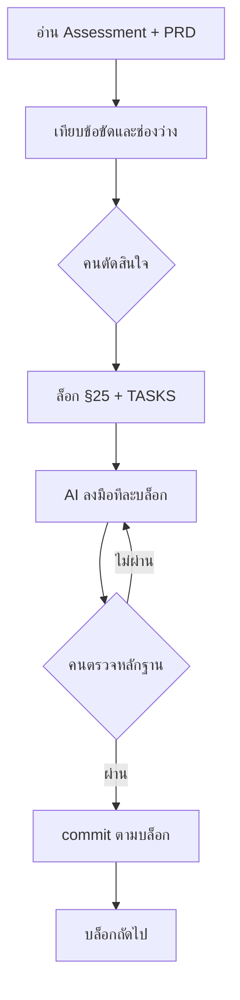

# LockGo — AI Workflow

เครื่องมือ: Cursor (Agent) อ่าน Assessment + PRD แล้วลงมือตาม `TASKS.md`  
แหล่งตัดสินใจ: [requirements.md](./requirements.md) §25 — AI ห้ามเปลี่ยนค่าที่ล็อกแล้วโดยไม่ถาม

## ภาพรวม

AI เขียนโค้ด เทสต์ และร่างเอกสาร คนเป็นคนเลือกกฎผลิตภัณฑ์ รับ/ทิ้งทางเลือก และห้ามขึ้นบล็อกถัดไปถ้าหลักฐานยังไม่ครบ

## ขั้นไหนใครทำ

| ขั้น | คน | AI |
|------|----|----|
| เทียบ `[A]` กับ `[P]` แล้วตั้ง C-01…C-09, U-01…U-06, S-01…S-08 | ตัดสินและล็อก | รวบรวมข้อขัด เสนอทางเลือก |
| กันจองซ้อนผูกช่อง ไม่ผูกผู้ใช้ | เลือก C-01 | เขียน `FOR UPDATE` + `EXCLUDE` |
| กันกดซ้ำด้วย idempotency key ไม่ใช้ unique `(user, compartment, start)` | เลือก S-05 เพราะยกเลิกแล้วจองใหม่ต้องได้ | เขียนตาราง + interceptor + ปุ่ม `isPending` |
| อ่าน/เขียนผ่าน Nest เท่านั้น | เลือก S-02 | ห้ามให้ web เรียก Data API |
| Realtime = สัญญาณ invalidate เท่านั้น | เลือก S-03 | subscribe แล้ว `invalidateQueries` |
| ไม่ใช้ `drizzle-kit push` | เลือก S-08 | generate แล้วตามด้วย SQL มือใน `supabase/migrations/` |
| บัญชีทดสอบ Alice / Bob | ยืนยันว่าต้องมีทางเข้าโดยไม่ตั้ง Google | เขียน seed ผ่าน Auth Admin API |
| Scaffold, schema, API, e2e, หน้าจอ, เทสต์ที่เหลือ | รับ/แก้ตอนรีวิว | ลงมือตามบล็อก A–G |
| Commit message และไฟล์ที่ขึ้น git | ห้ามขึ้น `.env` / `TASKS.md` / `NOTES.md` | stage เฉพาะไฟล์ของบล็อก |

## ลำดับที่ทำให้ความเสี่ยงลงก่อน

1. ล็อกเอกสาร — ถ้าสร้าง schema ก่อนตัดสิน C-01 จะรื้อตาราง
2. บล็อก B พิสูจน์จองซ้อนใน SQL ก่อนมี Nest
3. บล็อก C–E ปิด API และ e2e Alice/Bob พร้อมกัน
4. บล็อก F ทำ UI ทับสัญญาที่นิ่งแล้ว
5. บล็อก H เขียนจากของที่ทำจริง ไม่แต่ง prompt หลังจบงาน

## สิ่งที่ AI ทำไม่ได้แทนคน

- ใส่ `SUPABASE_SERVICE_ROLE_KEY` และ JWT secret ใน Dashboard
- ตั้ง Google Cloud OAuth client (ข้อ 23.5 ยังเป็นงานคน)
- ยืนยันว่าเครื่อง Windows นี้ resolve `db.*.supabase.co` ไม่ได้ — คนเห็น error แล้วให้ใช้ pooler
- ตัดสินว่าจะไม่แยก git repo แม้ขึ้น production คนละโปรเซส
