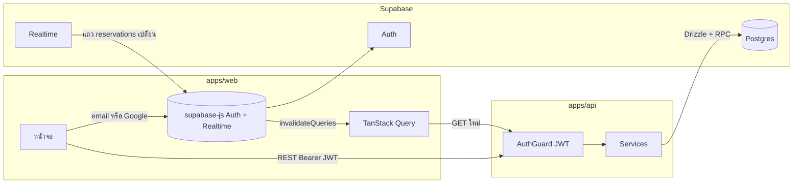
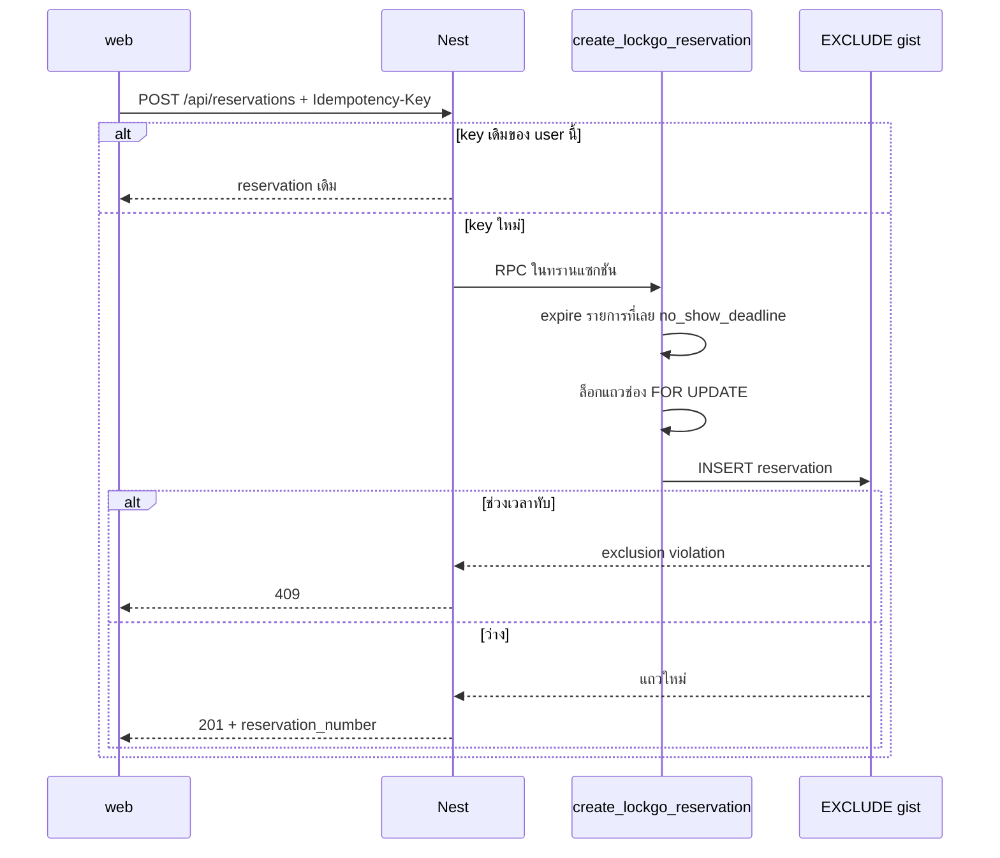

# LockGo — Architecture

แหล่งอ้างอิง: [requirements.md](./requirements.md) §25 S-01…S-08 · [erd.md](./erd.md)

แอปแยกสองโปรเซสใน monorepo เดียว deploy คนละที่ได้ สัญญาอยู่ที่ HTTP + JWT ไม่แยก Git repo

```
apps/web     React 19 + Vite + Tailwind     :5173
apps/api     NestJS                         :3000
packages/shared                             type / ค่าคงที่ร่วม
Supabase     Auth + Postgres + Realtime
```

## เส้นทางข้อมูล



## ใครคุยกับอะไร (S-02 · S-03)

| เส้น | จาก → ถึง | ใช้ทำ | ห้าม |
|------|-----------|--------|------|
| Auth SDK | web → Supabase Auth | login / session / JWT | ห้ามให้ web insert การจอง |
| REST | web → Nest `/api/*` | ค้นหา ดูจอง สร้างจอง ยกเลิก | ห้ามเรียก Supabase Data API |
| RPC / SQL | Nest → Postgres | availability + `create_lockgo_reservation` | ห้ามให้ frontend ถือ service role |
| Realtime | Supabase → web | สัญญาณอย่างเดียว | ห้ามเชื่อ event เป็นแหล่งความจริงของช่องว่าง |

เมื่อ Realtime บอกว่าตาราง `reservations` เปลี่ยน หน้าบ้านแค่ `invalidateQueries` แล้วดึง REST ใหม่ Availability จริงคิดที่ Nest / ฟังก์ชันล็อกทุกครั้ง

## ทำไม read/write เดินผ่าน Nest ทั้งหมด

1. กฎจองซ้อนอยู่ที่ `FOR UPDATE` + `EXCLUDE` — ต้องมีจุดเดียวที่เรียกฟังก์ชันนี้
2. ตัวกรอง ราคา Available Time และ sweep Expired ต้องใช้ SQL ที่ web ไม่ควรเขียนเอง
3. สิทธิ์เจ้าของ (403) และ idempotency interceptor อยู่ฝั่งเซิร์ฟเวอร์
4. เพิ่ม mobile หรือหน้าเจ้าหน้าที่ในอนาคตได้โดยไม่เปิด Data API ให้ client

web ถือได้แค่ publishable key สำหรับ Auth และ Realtime

## กันจองซ้อนสองชั้น + กันกดซ้ำ



ปุ่ม Confirm ต้อง `disabled` ตอน `isPending` ด้วย — ชั้นนี้กันคลิกซ้ำ ไม่ใช่กันสองคนจองช่องเดียว  
มือถือใช้ `compactButtonClass` บน `ActionBar` เดสก์ท็อปใช้ปุ่มเต็มความกว้างในการ์ดสรุป — ทั้งคู่ผูก `disabled` ชุดเดียวกัน

## พรมแดนโมดูล Nest

| โมดูล | ที่อยู่ | หน้าที่ |
|--------|---------|--------|
| Auth | `auth/auth.guard.ts` | ตรวจ JWT ด้วย `SUPABASE_JWT_SECRET` — ไม่แยก Nest module |
| Lockers | `LockersModule` | `GET /api/lockers` · `/locations` · `/{id}` |
| Reservations | `ReservationsModule` | สร้าง ดู ประวัติ ยกเลิก + idempotency interceptor |
| Pricing | ใน service ของ lockers / reservations | `max(rate × hours, 30)` |

path ไม่มี `/v1` และไม่ใช้คำว่า bookings (`T-01`)

## Deploy ในอนาคต

| ชิ้น | ขึ้นที่ | env ที่ต้องมี |
|------|---------|----------------|
| web | static host | `VITE_*` เท่านั้น |
| api | Node host | `SUPABASE_*` · `DATABASE_URL` · `PORT` |
| DB / Auth / Realtime | โปรเจกต์ LockGo ที่มีอยู่ | ไม่ commit key |

รอบส่งงานไม่ deploy production ตาม PRD §19 ผู้ตรวจรัน local ตาม README
